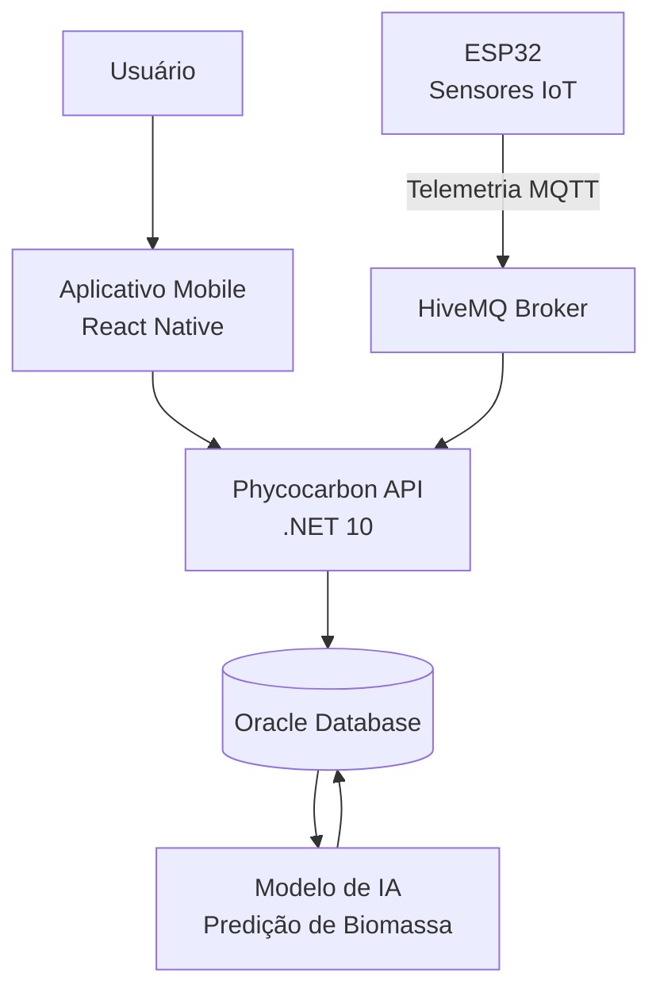

# 🌿 Phycocarbon — API de Ingestão e Telemetria IoT

> **Microsserviço .NET 10** responsável pela ingestão de telemetria de alta frequência, integração MQTT com dispositivos ESP32, consumo de dados orbitais e persistência de previsões geradas por Inteligência Artificial — componente central da plataforma Phycocarbon de monitoramento de biofotorreatores de microalgas.

---

## 📋 Índice

- [Visão Geral](#visão-geral)
- [Stack Tecnológica](#stack-tecnológica)
- [Estrutura do Projeto](#estrutura-do-projeto)
- [Domínio de Responsabilidade](#domínio-de-responsabilidade)
- [Fluxo de Telemetria MQTT](#fluxo-de-telemetria-mqtt)
- [Endpoints da API](#endpoints-da-api)
- [Como Executar](#como-executar)
- [Testes e Validação](#testes-e-validação)
- [Decisões de Arquitetura](#decisões-de-arquitetura)
- [Equipe](#equipe)

---

## Diagrama de Arquitetura



---

## Desenvolvimento

O projeto Phycocarbon foi desenvolvido utilizando ASP.NET Core 10 seguindo uma arquitetura em camadas, separando responsabilidades entre API, Aplicação, Domínio e Infraestrutura.

A comunicação com os dispositivos IoT ocorre por meio do protocolo MQTT utilizando o broker HiveMQ. Os sensores instalados nos ESP32 enviam métricas ambientais dos tanques de microalgas, como pH, temperatura, turbidez e luminosidade.

Os dados recebidos são processados pela API, validados e armazenados em banco Oracle através do Entity Framework Core.

Além do armazenamento das métricas, a solução permite integração com modelos de Inteligência Artificial para geração de previsões de biomassa e identificação antecipada do momento ideal para colheita.

## Visão Geral

O **Phycocarbon** é uma plataforma de bioeconomia que integra IoT, Machine Learning e dados orbitais (NASA/Copernicus) para otimizar o cultivo de microalgas como Spirulina e Chlorella em biofotorreatores. A plataforma viabiliza:

- Monitoramento contínuo de tanques via sensores embarcados
- Geração auditável de créditos de carbono baseados no CO₂ sequestrado
- Predição do pico de biomassa com 48 horas de antecedência
- Marketplace B2B para comercialização de biomassa de alta qualidade

Este repositório contém o **microsserviço .NET**, responsável exclusivamente pela camada de **ingestão, telemetria e dados operacionais brutos** do ecossistema.

---


## Stack Tecnológica

| Tecnologia | Versão | Função |
|---|---|---|
| ASP.NET Core | 10.0 | Framework da Web API REST |
| Entity Framework Core | 10.0.8 | ORM e mapeamento relacional |
| Oracle.EntityFrameworkCore | 10.23.26200 | Provider Oracle para EF Core |
| MQTTnet | 5.1.0 | Client MQTT para ingestão de telemetria |
| HiveMQ Broker | — | Broker MQTT público de desenvolvimento |
| Swashbuckle / OpenAPI | 10.2.1 | Documentação automática dos endpoints |


---

## Estrutura do Projeto

```
Phycocarbon.sln
│
├── Phycocarbon.API                         # Camada de apresentação
│   ├── Controllers/                        # Endpoints REST
│   │   ├── AlertaCriticoController.cs
│   │   ├── DadoOrbitalController.cs
│   │   ├── DispositivoIotController.cs
│   │   ├── FazendaController.cs
│   │   ├── IotController.cs               # Comandos bidirecionais para ESP32
│   │   ├── MetricaTanqueController.cs
│   │   ├── PerfilController.cs
│   │   ├── PrevisaoIaController.cs
│   │   ├── TanqueController.cs
│   │   └── UsuarioController.cs
│   ├── Exceptions/
│   │   └── GlobalExceptionHandler.cs      # Tratamento centralizado de erros
│   ├── Extensions/
│   │   └── PhycocarbonServiceCollectionExtensions.cs  # Registro de DI
│   ├── HostedServices/
│   │   └── MqttTelemetryBackgroundService.cs          # Worker MQTT em background
│   └── Program.cs
│
├── Phycocarbon.Application                 # Camada de aplicação
│   ├── DTOs/                              # Contratos de entrada e saída
│   ├── Repositories/                      # Interfaces de repositório
│   └── Services/
│       ├── Interfaces/                    # Contratos de serviço
│       └── Implementations/              # Lógica de aplicação
│
├── Phycocarbon.Domain                      # Camada de domínio
│   ├── Entities/                          # Entidades do domínio
│   │   ├── AlertaCritico.cs
│   │   ├── DadoOrbital.cs
│   │   ├── DispositivoIot.cs
│   │   ├── Fazenda.cs
│   │   ├── MetricaTanque.cs
│   │   ├── Perfil.cs
│   │   ├── PrevisaoIa.cs
│   │   ├── Tanque.cs
│   │   └── Usuario.cs
│   └── Helpers/
│       └── HashHelper.cs
│
└── Phycocarbon.Infrastructure              # Camada de infraestrutura
    ├── Messaging/                         # Integração MQTT
    │   ├── MqttConsumerService.cs         # Subscrição de tópicos
    │   ├── MqttTelemetryProcessor.cs      # Processamento de payload
    │   ├── MqttCommandPublisher.cs        # Publicação de comandos (atuadores)
    │   ├── MqttOptions.cs
    │   └── TelemetriaPayload.cs
    ├── Persistence/
    │   ├── PhycocarbonContext.cs          # DbContext Oracle
    │   ├── Configurations/               # Fluent API para mapeamento de tabelas
    │   └── Repositories/                 # Implementações dos repositórios
    └── Migrations/                        # Histórico de migrações EF Core
```

---

## Domínio de Responsabilidade

Este microsserviço é o **dono exclusivo** das seguintes tabelas Oracle:

| Tabela | Descrição |
|---|---|
| `TB_DISPOSITIVO_IOT` | Registro e status das placas ESP32 de campo (MAC Address, localização, tanque vinculado)| 
| `TB_METRICAS_TANQUE` | Série temporal de pH, temperatura, turbidez e luminosidade recebida via MQTT |
| `TB_ALERTA_CRITICO` | Alertas gerados por valores fora dos limites biológicos toleráveis |
| `TB_DADO_ORBITAL` | Histórico diário de radiação PAR e índices UV consumidos da NASA/Copernicus |
| `TB_PREVISOES_IA` | Resultados preditivos do modelo de ML sobre crescimento de biomassa nas próximas 48h |

> As tabelas de negócio (`TB_FAZENDA`, `TB_TANQUE`, `TB_USUARIO`, `TB_CREDITO_CARBONO`, `TB_TRANSACAO_MARKETPLACE`) são propriedade da API Java Spring Boot.

---

## Fluxo de Telemetria MQTT

```
ESP32 (Campo)
    │  publica JSON no tópico
    │  phycocarbon/fiap/tanque01/telemetria
    ▼
HiveMQ Broker (broker.hivemq.com:1883)
    │
    ▼
MqttTelemetryBackgroundService   ← IHostedService em background
    │  recebe a mensagem bruta
    ▼
MqttConsumerService
    │  entrega o payload como string
    ▼
MqttTelemetryProcessor
    │  deserializa JSON → TelemetriaMqttDto
    │  valida campos obrigatórios
    │  localiza DispositivoIot no banco
    │  identifica Tanque vinculado
    ▼
MetricaTanqueService
    │  mapeia para entidade MetricaTanque
    ▼
MetricaTanqueRepository
    │
    ▼
Oracle Database → TB_METRICAS_TANQUE
```

**Payload esperado do ESP32:**

```json
{
  "dispositivo_id": 123,
  "pH": 7.2,
  "temp": 26.5,
  "turbidez": 18.4,
  "luminosidade": 850,
  "status": "OK",
  "pronto_colheita": false,
  "servo_aberto": true
}
```

---

## Endpoints da API

Todos os endpoints seguem o padrão `/api/[controller]`.

| Controller | Métodos Disponíveis | Descrição |
|---|---|---|
| `AlertaCritico` | GET, GET/{id}, POST, PATCH/{id}/resolver, DELETE/{id} | Gestão de alertas críticos de tanques |
| `DadoOrbital` | GET, GET/{id}, POST, DELETE/{id} | Dados de radiação PAR e índices UV orbitais |
| `DispositivoIot` | GET, GET/{id}, POST, DELETE/{id} | Cadastro e gerenciamento de placas ESP32 |
| `Fazenda` | GET, GET/{id} | Consulta de fazendas (leitura; escrita na API Java) |
| `Iot` | POST /telemetria, POST /comando | Ingestão manual de telemetria e envio de comandos a atuadores |
| `MetricaTanque` | GET, GET/{id}, POST, DELETE/{id} | Registro e consulta do histórico de métricas |
| `Perfil` | GET, GET/{id} | Consulta de perfis de acesso |
| `PrevisaoIa` | GET, GET/{id}, POST, DELETE/{id} | Previsões de biomassa geradas pelo modelo de ML |
| `Tanque` | GET, GET/{id} | Consulta de tanques (leitura; escrita na API Java) |
| `Usuario` | GET, GET/{id} | Consulta de usuários |

A documentação interativa completa está disponível via **Swagger UI** em `/` após iniciar a aplicação.

---

## Como Executar

### Pré-requisitos

- [.NET SDK 10.0](https://dotnet.microsoft.com/download)
- Oracle Database acessível (local, container ou cloud)
- Acesso ao broker MQTT (padrão: `broker.hivemq.com`)

### 1. Clonar o repositório

```bash
git clone <url-do-repositorio>
cd gs1-NET
```

### 2. Restaurar dependências

```bash
dotnet restore
```

### 3. Configurar a conexão Oracle

Edite `Phycocarbon.API/appsettings.json`:

```json
{
  "ConnectionStrings": {
    "OracleDb": "User Id=SEU_USUARIO;Password=SUA_SENHA;Data Source=SEU_HOST:1521/SEU_SERVICE_NAME"
  },
  "Mqtt": {
    "Host": "broker.hivemq.com",
    "Port": 1883,
    "Topic": "phycocarbon/fiap/tanque01/telemetria",
    "ClientId": "phycocarbon-api"
  }
}
```

### 4. Aplicar as migrações

```bash
dotnet ef database update --project Phycocarbon.Infrastructure --startup-project Phycocarbon.API
```

### 5. Executar a API

```bash
dotnet run --project Phycocarbon.API
```

### 6. Acessar o Swagger

```
https://localhost:7254
http://localhost:5281
```

---

## Testes e Validação

### Teste 1 — Consulta de Métricas via Swagger

```http
GET /api/MetricaTanque
```

**Resultado esperado:** HTTP 200 com lista de métricas persistidas.

---

### Teste 2 — Inserção Manual via REST

```bash
curl -X POST https://localhost:7254/api/MetricaTanque \
  -H "Content-Type: application/json" \
  -d '{
    "idDispositivo": 123,
    "idTanque": 10,
    "ph": 7.2,
    "temperatura": 26.5,
    "turbidez": 18.4,
    "luminosidade": 850
  }'
```

**Resultado esperado:** HTTP 201 Created com registro persistido no Oracle.

---

### Teste 3 — Ingestão via MQTT

Publique no tópico `phycocarbon/fiap/tanque01/telemetria` usando qualquer cliente MQTT (MQTTX, mosquitto_pub):

```bash
mosquitto_pub \
  -h broker.hivemq.com \
  -t "phycocarbon/fiap/tanque01/telemetria" \
  -m '{"dispositivo_id":123,"pH":7.2,"temp":26.5,"turbidez":18.4,"luminosidade":850,"status":"OK","pronto_colheita":false,"servo_aberto":true}'
```

**Fluxo esperado:** Consumer recebe → Processor valida → dispositivo localizado → métrica persistida.

---

### Teste 4 — Alerta de pH Crítico

Publique um payload com pH fora do range biológico tolerável:

```bash
mosquitto_pub \
  -h broker.hivemq.com \
  -t "phycocarbon/fiap/tanque01/telemetria" \
  -m '{"dispositivo_id":123,"pH":4.2,"temp":25.0,"turbidez":18.4,"luminosidade":850,"status":"ALERTA","pronto_colheita":false,"servo_aberto":false}'
```

**Resultado esperado:** Registro inserido em `TB_METRICAS_TANQUE`; Trigger Oracle intercepta pH < 5.0 e cria entrada em `TB_ALERTA_CRITICO` automaticamente.

---

## Decisões de Arquitetura

**Separação de contextos por domínio de escrita**
O .NET é write-intensive: absorve o fluxo contínuo do ESP32 sem impactar as operações transacionais financeiras da API Java. Cada microsserviço escala de forma independente.

**MqttTelemetryProcessor desacoplado do Consumer**
O Consumer apenas entrega o payload como string. Todo o parsing, validação e orquestração são responsabilidade do Processor, facilitando testes unitários isolados e a troca futura do broker.

**Reutilização da camada de serviços para ingestão MQTT**
A métrica recebida via MQTT passa exatamente pelo mesmo fluxo que uma métrica recebida via REST (`MetricaTanqueService → Repository`), garantindo consistência e eliminando duplicação de lógica.

**Bridge PL/SQL como integração entre microsserviços**
A comunicação entre .NET e Java ocorre exclusivamente pelo banco Oracle via Procedures PL/SQL, evitando acoplamento direto entre os dois serviços e mantendo a transacionalidade garantida pelo SGBD.

**Documentação XML no Swagger**
`GenerateDocumentationFile=true` no `.csproj` garante que os XML comments dos controllers alimentam automaticamente o Swagger, mantendo a documentação sempre sincronizada com o código.

---

## Equipe

| Nome | RM | Turma | GitHub |
|---|---|---|---|
| Alexander Dennis Isidro Mamani | 565554 | 2TDSPG | [@alex-isidro](https://github.com/alex-isidro) |
| Arthur Brito da Silva | 562085 | 2TDSPG | [@thubrito](https://github.com/thubrito) |
| Kelson Zhang | 563748 | 2TDSPG | [@KelsonZh0](https://github.com/KelsonZh0) |
| Luiz Felipe Flosi dos Santos | 563197 | 2TDSPG | [@felipeflosii](https://github.com/felipeflosii) |
| Pedro Henrique Brum Lopes | 561780 | 2TDSPG | [@PedroBrum-DEV](https://github.com/PedroBrum-DEV) |


