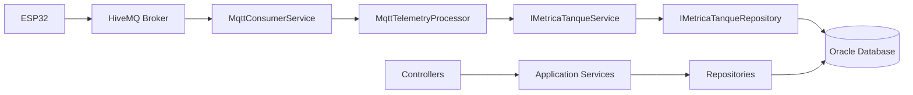
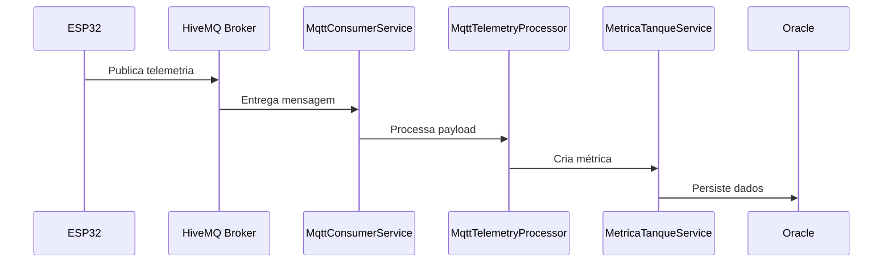

# Phycocarbon

Plataforma de monitoramento para biofotorreatores com ingestão de telemetria via MQTT, persistência em Oracle Database e exposição de APIs REST para operação e consulta de dados.

---

## Objetivo do Projeto

A Phycocarbon é uma plataforma de monitoramento para biofotorreatores utilizados no cultivo de microalgas.

A solução recebe dados de sensores embarcados em dispositivos ESP32 através do protocolo MQTT, processa as informações recebidas e realiza a persistência em Oracle Database.

Além do monitoramento operacional dos tanques, a plataforma disponibiliza APIs REST para gerenciamento de usuários, fazendas, tanques, dispositivos IoT, métricas, alertas críticos, dados orbitais e previsões geradas por inteligência artificial.

---

# Problema Resolvido

Antes do fluxo atual, a telemetria IoT não estava conectada a um pipeline completo de ingestão e persistência.

O projeto resolve esse problema integrando:

* Sensores embarcados em ESP32;
* Comunicação MQTT;
* Processamento assíncrono das mensagens;
* Persistência estruturada em Oracle Database;
* Consulta dos dados através de APIs REST.

Dessa forma, as informações coletadas nos tanques passam a ser armazenadas e disponibilizadas para monitoramento e análise.

---

# Arquitetura da Solução

A solução preserva a arquitetura baseada em:

```text
Controller → Service → Repository → Oracle Database
```

e adiciona uma camada de mensageria MQTT responsável pela ingestão de telemetria.

## Diagrama de Arquitetura



---

## Fluxo de Telemetria MQTT



---

## Desenvolvimento da Solução

A aplicação foi desenvolvida utilizando ASP.NET Core Web API seguindo uma arquitetura em camadas.

### Estrutura dos Projetos

- Phycocarbon.API
  - Controllers
  - Swagger
  - Configurações da aplicação

- Phycocarbon.Application
  - DTOs
  - Serviços
  - Interfaces
  - Contratos de repositório

- Phycocarbon.Domain
  - Entidades de domínio

- Phycocarbon.Infrastructure
  - Persistência Oracle
  - Repositórios
  - Integração MQTT
  - Serviços de mensageria

### Funcionalidades Implementadas

- Cadastro e consulta de usuários.
- Cadastro e consulta de perfis.
- Cadastro e consulta de fazendas.
- Cadastro e consulta de tanques.
- Cadastro e consulta de dispositivos IoT.
- Registro de métricas dos tanques.
- Gerenciamento de alertas críticos.
- Consulta de dados orbitais.
- Consulta de previsões geradas por IA.
- Ingestão automática de telemetria via MQTT.

## Fluxo de Funcionamento

1. O ESP32 publica dados no broker MQTT.
2. O `MqttConsumerService` recebe a mensagem.
3. O `MqttTelemetryProcessor` interpreta e valida o payload.
4. O dispositivo é localizado no banco de dados.
5. O tanque associado é identificado.
6. A métrica é persistida utilizando os serviços da aplicação.
7. Os dados ficam disponíveis para consulta via API REST.

## Decisões Técnicas

* O consumidor MQTT não acessa diretamente o banco de dados.
* O processamento do payload é centralizado em um componente dedicado.
* A camada de serviços existente foi reutilizada.
* A persistência continua sendo realizada através dos repositórios da aplicação.
* O Oracle Database é utilizado como banco principal.

---

# Tecnologias Utilizadas

* .NET 10
* Entity Framework Core
* Oracle Database
* MQTTnet
* Swagger / OpenAPI
* REST API

---

# Requisitos para Execução

Antes de executar o projeto, é necessário possuir:

* .NET SDK compatível com o projeto
* Oracle Database
* Broker MQTT compatível com HiveMQ
* Visual Studio ou Visual Studio Code

---

# Como Executar

## 1. Clonar o repositório

```bash
git clone <url-do-repositorio>
cd Phycocarbon
```

## 2. Restaurar dependências

```bash
dotnet restore
```

## 3. Configurar a conexão Oracle

No arquivo:

```text
Phycocarbon.API/appsettings.json
```

Configure:

```json
{
  "ConnectionStrings": {
    "OracleDb": "User Id=SEU_USUARIO;Password=SUA_SENHA;Data Source=SEU_HOST:1521/SEU_SERVICE_NAME"
  }
}
```

## 4. Configurar MQTT

```json
{
  "Mqtt": {
    "Host": "broker.hivemq.com",
    "Port": 1883,
    "Topic": "phycocarbon/fiap/tanque01/telemetria",
    "ClientId": "phycocarbon-api"
  }
}
```

## 5. Compilar o projeto

```bash
dotnet build
```

## 6. Executar a API

```bash
dotnet run --project Phycocarbon.API
```

---

# Acesso à Aplicação

Após iniciar a API:

```text
Swagger:
https://localhost:7254

HTTP:
http://localhost:5281
```

Todos os endpoints podem ser testados diretamente pela interface Swagger.

---

# Endpoints Disponíveis

Todos os controllers seguem o padrão:

```text
api/[controller]
```

| Recurso        | Rotas                       |
| -------------- | --------------------------- |
| AlertaCritico  | GET, GET/{id}, POST, DELETE |
| DadoOrbital    | GET, GET/{id}, POST, DELETE |
| DispositivoIot | GET, GET/{id}, POST, DELETE |
| Fazenda        | GET, GET/{id}               |
| MetricaTanque  | GET, GET/{id}, POST, DELETE |
| Perfil         | GET, GET/{id}               |
| PrevisaoIa     | GET, GET/{id}, POST, DELETE |
| Tanque         | GET, GET/{id}               |
| Usuario        | GET, GET/{id}               |

---

# Testes

## Cenários de Teste

| Teste              | Objetivo                     |
| ------------------ | ---------------------------- |
| GET MetricaTanque  | Verificar resposta da API    |
| POST MetricaTanque | Validar persistência manual  |
| Publicação MQTT    | Validar ingestão automática  |
| Consulta Oracle    | Confirmar gravação dos dados |

---

## Teste 1 — Consulta via Swagger

Acesse o Swagger e execute:

```http
GET /api/MetricaTanque
```

### Resultado Esperado

* HTTP 200 OK
* Lista de métricas retornada
* Ausência de erros nos logs

---

## Teste 2 — Criação de Métrica via REST

Exemplo utilizando curl:

```bash
curl -X POST https://localhost:7254/api/MetricaTanque \
-H "Content-Type: application/json" \
-d "{
  \"idDispositivo\":123,
  \"idTanque\":10,
  \"ph\":7.2,
  \"temperatura\":26.5,
  \"turbidez\":18.4,
  \"luminosidade\":850
}"
```

### Resultado Esperado

* HTTP 201 Created
* Registro criado no banco
* Retorno contendo os dados persistidos

---

## Teste 3 — Ingestão MQTT

Publicar o seguinte payload no tópico configurado:

```json
{
  "dispositivo_id": 123,
  "pH": 7.2,
  "temp": 26.5,
  "turbidez": 18.4,
  "luminosidade": 850,
  "status": "OK",
  "pronto_colheita": false,
  "servo_aberto": true
}
```

### Fluxo Esperado

1. O MQTT recebe a mensagem.
2. O Consumer processa a mensagem.
3. O Processor valida o payload.
4. O dispositivo é localizado.
5. O tanque é identificado.
6. A métrica é persistida.

---

## Teste 4 — Validação no Oracle

Após publicar a mensagem MQTT, execute:

```sql
SELECT
    ID_METRICA,
    ID_DISPOSITIVO,
    ID_TANQUE,
    DT_LEITURA,
    PH,
    TEMPERATURA,
    TURBIDEZ,
    LUMINOSIDADE
FROM TB_METRICAS_TANQUE
ORDER BY ID_METRICA DESC;
```

### Resultado Esperado

* Novo registro inserido.
* Dados compatíveis com o payload enviado.
* Persistência confirmada.

---

## Estrutura do Projeto

```text
Phycocarbon.sln

├── Phycocarbon.API
│   ├── Controllers
│   ├── Extensions
│   ├── Program.cs
│   └── appsettings.json
│
├── Phycocarbon.Application
│   ├── DTOs
│   ├── Interfaces
│   ├── Services
│   └── Repositories
│
├── Phycocarbon.Domain
│   └── Entities
│
└── Phycocarbon.Infrastructure
    ├── Repositories
    ├── Persistence
    └── Messaging
        ├── MqttConsumerService
        ├── MqttTelemetryProcessor
        └── MqttOptions
```

---

# 👥 Integrantes da Equipe

| Nome                           | RM     | Turma  | GitHub        |
| ------------------------------ | ------ | ------ | ------------- |
| Alexander Dennis Isidro Mamani | 565554 | 2TDSPG | alex-isidro   |
| Arthur Brito da Silva          | 562085 | 2TDSPG | thubrito      |
| Kelson Zhang                   | 563748 | 2TDSPG | KelsonZh0     |
| Luiz Felipe Flosi dos Santos   | 563197 | 2TDSPG | felipeflosii  |
| Pedro Henrique Brum Lopes      | 561780 | 2TDSPG | PedroBrum-DEV |
